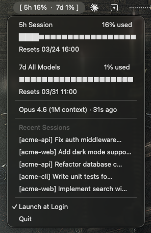

# claude-usage-bar

macOS menu bar widget that displays your Claude Code rate limit usage in real time.



## How it works

Claude Code sends rate limit data via the `statusLine` hook on every assistant message. This tool captures that data and displays it in your macOS menu bar.

- **Menu bar** — shows 5h session and 7d weekly usage at a glance
- **Dropdown** — detailed view with progress bars and reset times
- **Auto-refresh** — updates every time you chat with Claude Code
- **Inactive state** — shows ⏸ when Claude Code hasn't been used for 10+ minutes

## Install

```bash
brew tap hwayoungjun/tap
brew install claude-usage-bar
```

Or build from source:

```bash
git clone https://github.com/hwayoungjun/claude-usage-bar.git
cd claude-usage-bar
go build -o claude-usage-bar .
```

## Setup

```bash
claude-usage-bar setup        # Auto-configure ~/.claude/settings.json
claude-usage-bar              # Launch menu bar widget
```

That's it. Restart Claude Code after setup.

Auto-start on login:

```bash
brew services start claude-usage-bar
```

## Requirements

- macOS
- Claude Code v2.1.80+ (for `rate_limits` in statusLine)
- Claude Pro / Max / Team plan (rate limit data requires a subscription)

## How data flows

```
Claude Code ──stdin──▶ claude-usage-bar statusline ──▶ ~/.config/claude-usage-bar/usage.json
                                                              │
                                                              ▼
                                                     claude-usage-bar (menu bar)
```

1. Claude Code calls `claude-usage-bar statusline` after each assistant message
2. The statusline subcommand parses rate limit data from stdin and writes to `usage.json`
3. The menu bar widget watches `usage.json` via fsnotify and updates instantly

## License

MIT

> This project is not affiliated with Anthropic. Claude and Claude Code are trademarks of Anthropic.
