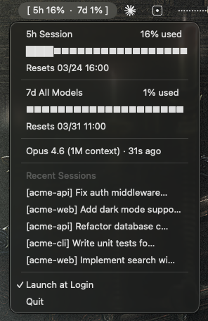

# claude-usage-bar

macOS menu bar widget that displays your Claude Code rate limit usage in real time.



## How it works

Claude Code sends rate limit data via the `statusLine` hook on every assistant message. This tool captures that data and displays it in your macOS menu bar.

Sessions started from the Claude desktop app are covered too. `statusLine` never fires for those — the app runs Claude Code headless and draws its own UI, so there is no terminal status line to render — so the widget falls back to the usage history the desktop app keeps for its own meter (`~/Library/Application Support/Claude/plan-usage-history.json`). That costs no API call and no credentials, but it only carries percentages, and only about every 15 minutes.

- **Menu bar** — shows 5h session and 7d weekly usage at a glance, marked `⚠` once a window reaches 80%
- **Display modes** — toggle between `5h + 7d` (full) and `5h only` (short) from the **Display** submenu; preference is persisted
- **Dropdown** — detailed view with progress bars and reset times
- **Recent sessions** — shows last 5 sessions; click to copy `claude --resume` command
- **Auto-refresh** — updates every time you chat with Claude Code
- **Inactive state** — shows ⏸ when Claude Code hasn't been used for 10+ minutes

## Install

```bash
brew tap hwayoungjun/tap
brew install claude-usage-bar
```

Setup is automatic — `~/.claude/settings.json` is configured on install and every app launch.

Or build from source:

```bash
git clone https://github.com/hwayoungjun/claude-usage-bar.git
cd claude-usage-bar
go build -o claude-usage-bar .
./claude-usage-bar setup
```

### Makefile

Common tasks are available via `make`:

```bash
make build              # build ./bin/claude-usage-bar
make dev                # run in foreground (debugging)
make install            # install to /usr/local/bin (or PREFIX=/opt/homebrew on Apple Silicon)
make uninstall          # remove binary + run app uninstall
make setup              # configure ~/.claude/settings.json
make release            # build darwin arm64 + amd64 binaries
make help               # list all targets
```

## Usage

```bash
claude-usage-bar                # Launch (backgrounds automatically)
```

Auto-start on login (pick one):

```bash
brew services start claude-usage-bar    # via Homebrew service
```

Or enable **"Launch at Login"** from the dropdown menu.

## Uninstall

```bash
brew uninstall claude-usage-bar
```

This automatically removes the LaunchAgent, statusLine config, and app data.

## Requirements

- macOS (Apple Silicon / Intel)
- Claude Code v2.1.80+ (for `rate_limits` in statusLine)
- Claude Pro / Max / Team plan (rate limit data requires a subscription)

## How data flows

```
Claude Code (terminal) ──stdin──▶ claude-usage-bar statusline ──▶ usage.json
                                                                     │
                                                                     ▼
Claude desktop app ──▶ plan-usage-history.json ──────────▶ claude-usage-bar (menu bar)
```

1. Claude Code calls `claude-usage-bar statusline` after each assistant message
2. The statusline subcommand parses rate limit data from stdin and writes to `~/.config/claude-usage-bar/usage.json`
3. The menu bar widget watches `usage.json` via fsnotify and updates instantly
4. When the desktop app's history is more recent than the last `statusLine` report, the widget shows that instead, labelled `Claude app`; reset times carry over from the last `statusLine` report while they are still in the future

## Project layout

Dependencies point one way: the composition root wires adapters to the domain,
and the domain knows about neither.

```
main.go                  composition root — subcommand dispatch and wiring
internal/app             shared identifiers (binary name, launchd labels)
internal/usage           domain — readings, which source to trust, staleness, formatting
internal/session         domain — session rows and layout, plus the transcript reader
internal/textwidth       domain — display-column measurement and truncation
internal/store           adapters — usage.json, desktop history, preferences, instance lock
internal/statusline      adapter — the Claude Code hook payload
internal/install         adapters — Claude Code settings, LaunchAgent, uninstall
internal/ui              adapter — the systray menu
```

```bash
make test
```

The domain packages carry the tests: usage 98%, session 92%, textwidth 100%,
statusline 93%. The systray layer holds no rules and is not covered.

## License

MIT

> This project is not affiliated with Anthropic. Claude and Claude Code are trademarks of Anthropic.
